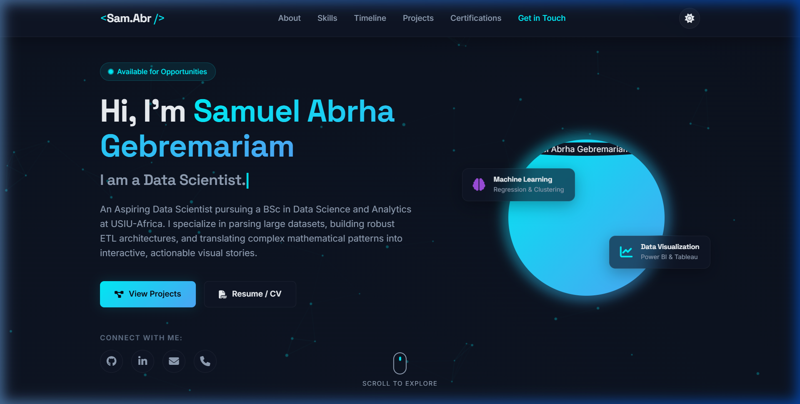
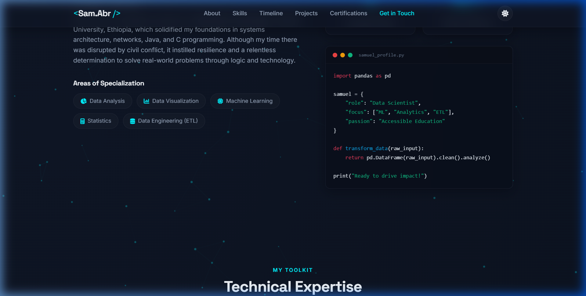
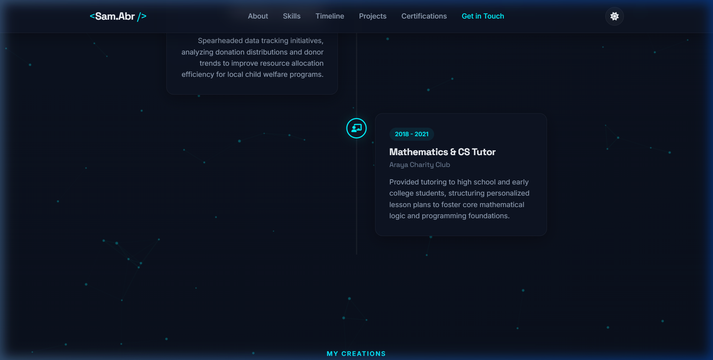

# 🌌 Samuel Abrha Gebremariam | Data Scientist Portfolio

[](https://samuel-portfolio-fawn-three.vercel.app)
[](https://github.com/SamAbr/My-Portfolio)

An interactive, responsive, and visually stunning personal portfolio showcasing projects, technical expertise, and career journey in Data Science.

---

## 📸 Preview

### Hero & Introduction


### Specializations & Tech Stack


### Timeline & Experience


---

## ✨ Features

- **Dynamic UI/UX**: Custom responsive layout with modern glassmorphism aesthetic.
- **Interactive Timeline**: Clean career and academic timeline detailing progress and achievements.
- **Project Showcase**: Rich list of data science projects, descriptions, and technology stacks.
- **Animations & Effects**: Smooth transitions, text typewriter effect, and interactive elements.
- **Performance Optimized**: Built with vanilla HTML, CSS, and JS for near-instant load speeds.

---

## 🛠️ Technology Stack

- **Frontend**: HTML5, Vanilla CSS3 (Custom transitions, gradients, layouts)
- **Logic**: ES6+ JavaScript (DOM Manipulation, interactive effects)
- **Hosting**: Deployed on **Vercel**
- **Version Control**: Hosted on **GitHub**

---

## 🚀 Running Locally

To run the project on your machine:

1. **Clone the repository**:
   ```bash
   git clone https://github.com/SamAbr/My-Portfolio.git
   ```
2. **Navigate to the directory**:
   ```bash
   cd My-Portfolio
   ```
3. **Open the site**:
   - Double-click `index.html` to open it in your browser.
   - Alternatively, serve it using any local server (e.g., Live Server extension in VS Code).

---

## 📬 Contact & Connect

- **Email**: [sabrha@usiu.ac.ke](mailto:sabrha@usiu.ac.ke)
- **LinkedIn**: [Samuel Abrha](https://linkedin.com)
- **GitHub**: [@SamAbr](https://github.com/SamAbr)
